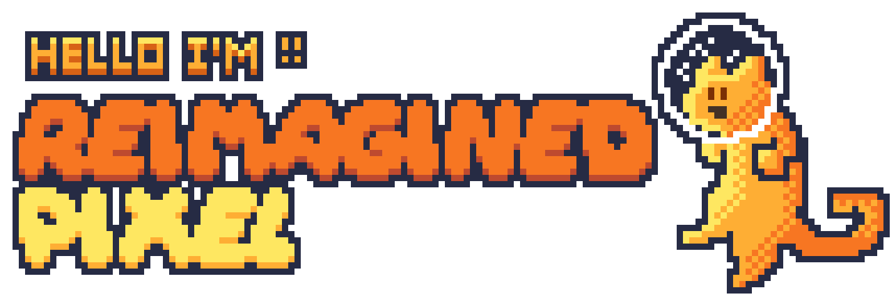
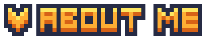
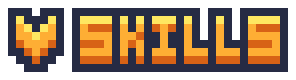
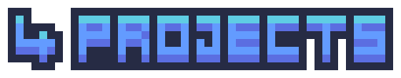
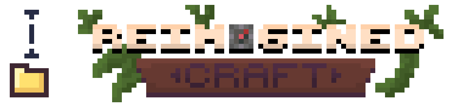
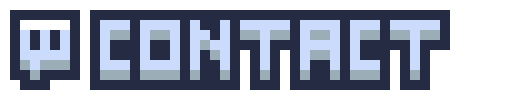

  

 
I'm a 16-year-old developer from Poland.
Solo dev.I've been making Minecraft servers for over 6 years.
Started modding Minecraft before I knew what Java was.
Most of my projects live and die on my own machine first I go by ReimaginedPixel online.
I attend a technical high school in Poland.
I build things I'd actually want to play myself.
I've been editing videos almost as long as I've been coding.
I make content about the things I build.

  
I know HTML and CSS well enough to build something with them.
I've been doing pixel art and texturing for about 2 years.
I model in Blockbench. I've made custom weapons, items, and mobs.
I can edit video. I've been doing it for years, not days.
I write PHP for backend stuff. Nothing fancy, just what works.
C++ is something I've worked with for a couple of years, mostly for school and small tools.
I use SQLite and MySQL depending on the project.

  

  

[ReimaginedCraft](https://www.reimaginedcraft.net) is a medieval fantasy Minecraft survival server I've been building solo for over two years.
I'm not copying an existing server. I'm building something I'd actually want to play.
Every major system is a custom plugin I wrote myself.
Your tools are gated behind skill levels. You can't use a better pickaxe until you've earned the mining level for it.
I use ItemsAdder, MythicMobs, AuraSkills, and a dozen other plugins alongside my own.

  

[Freaky Smp](https://reimaginedpixel.github.io/FreakySmpWebsite/#players) started because I switched schools and wanted a way to get to know my new classmates.
I set up a Minecraft server. People joined. It worked.
At its peak it had 30+ players. Over time it attracted cheaters and it became kind of a meme to try and nuke it.
That chaos is honestly part of what made it memorable.
Multiple seasons ran. Each one had its own story.
It wasn't a serious project. It was a community that formed around a server I made.

  
[Website Soon]

PROTOCOL:ENDFALL is a standalone permadeath Minecraft experience
the concept is simple: you get one life. If you die, you can never play again.
The launcher is part of the game. There's no separation between the two.
When you launch it, Minecraft starts automatically. No title screen, no pause menu, no GUI.
When you die, the game closes. The launcher shows a final screen. It never opens Minecraft again.

  

